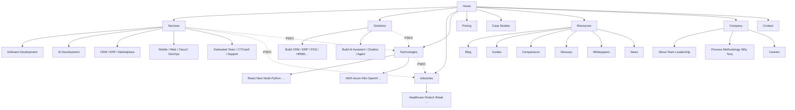
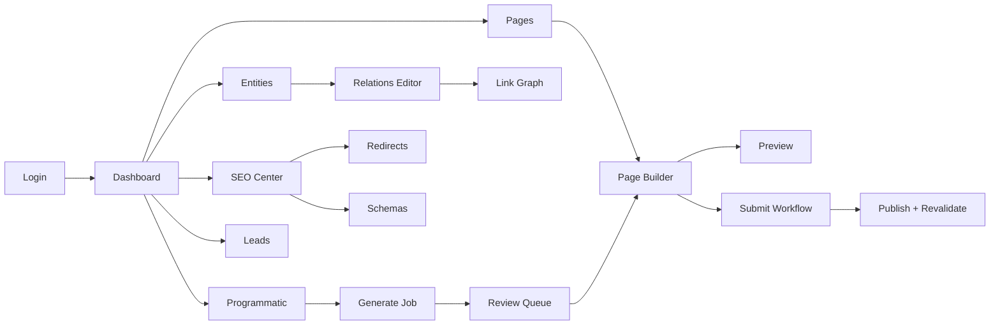
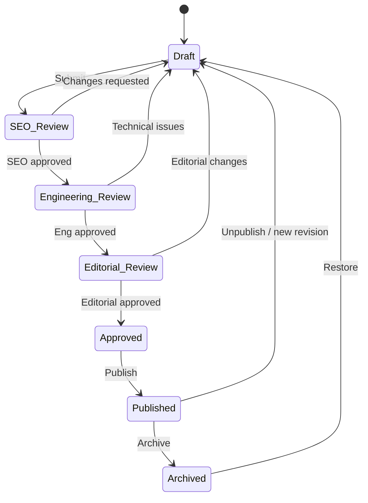
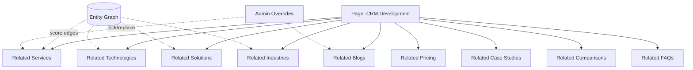
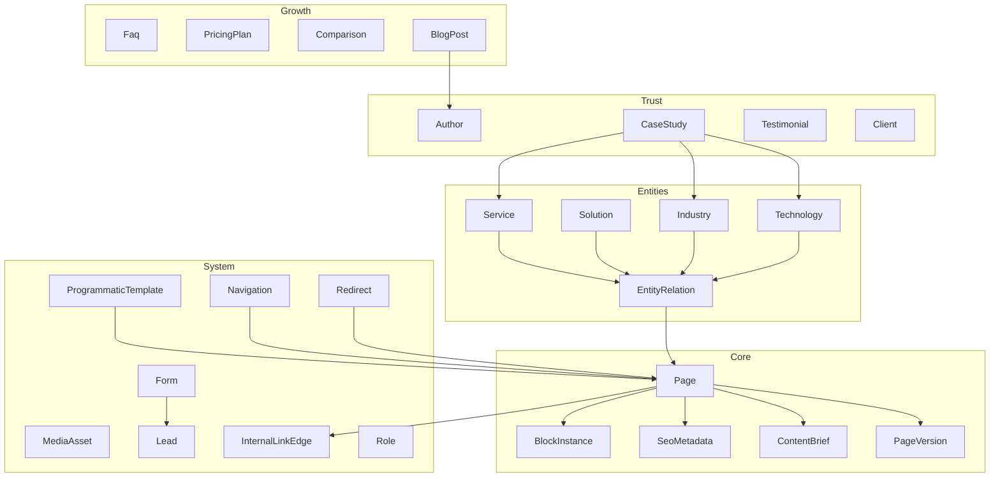

# Torq Studio — Enterprise SEO-First Platform Architecture

> **Version:** 1.0 · **Status:** Architecture Blueprint  
> **Scope:** Scale from ~50 → 10,000+ pages (target: 100,000+) without architectural rewrite  
> **Principles:** Contentful-style content model · HubSpot-style entities · Webflow-style page builder · Shopify-style URL/entity scale · Atlassian-style permissions & workflow

This document is the system of record for the Torq Studio marketing + CMS platform. Implementation evolves the existing Next.js 16 App Router codebase in `tourq26/` from hardcoded/marketing JSON pages into a modular, entity-driven CMS.

---

## Table of Contents

1. [Complete Folder Structure](#1-complete-folder-structure)
2. [Database Schema](#2-database-schema)
3. [Admin Architecture](#3-admin-architecture)
4. [API Architecture](#4-api-architecture)
5. [Frontend Architecture](#5-frontend-architecture)
6. [Component Architecture](#6-component-architecture)
7. [SEO Architecture](#7-seo-architecture)
8. [Internal Linking Engine](#8-internal-linking-engine)
9. [Entity Relationship Diagram](#9-entity-relationship-diagram)
10. [CMS UI Wireframes](#10-cms-ui-wireframes)
11. [Navigation Flow](#11-navigation-flow)
12. [Permission Matrix](#12-permission-matrix)
13. [Folder Naming Convention](#13-folder-naming-convention)
14. [URL Structure](#14-url-structure)
15. [Recommended Tech Stack](#15-recommended-tech-stack)
16. [Future Scalability Plan](#16-future-scalability-plan)
17. [Mermaid Diagrams](#17-mermaid-diagrams)

---

## Design Tenets

| Tenet | Rule |
|-------|------|
| **Page ≠ Code** | No hardcoded marketing pages. Every page is a CMS document composed of blocks. |
| **Entity Graph First** | Services, Solutions, Industries, Technologies, Content are first-class entities with typed edges. |
| **One Renderer** | Manual pages and programmatic pages share the same block renderer + SEO pipeline. |
| **ISR by Default** | Publish → revalidate tags. Never rebuild the whole site for one page. |
| **SEO is a Module** | Metadata, schema, canonicals, robots live on every page type — not bolted on later. |
| **Linking is Computed** | Related content is derived from the entity graph, overridable by editors. |
| **Workflow Gates Quality** | Draft → SEO → Eng → Editorial → Approved → Published → Archived. |
| **AI-Ready Surfaces** | `llms.txt`, FAQ schema, entity summaries, content briefs feed AI search. |

---

## 1. Complete Folder Structure

```text
tourq26/
├── prisma/
│   ├── schema.prisma                 # Hub (existing) + CMS models (merged or multi-schema)
│   ├── cms.prisma                    # CMS blueprint (see docs/architecture/schemas)
│   ├── seed.ts
│   └── seed/
│       ├── entities.ts               # Services, solutions, industries, technologies
│       ├── blocks.ts                 # Block type registry seed
│       ├── navigation.ts
│       └── programmatic-templates.ts
│
├── content/                          # Fallback / seed JSON (dev & migration only)
│   └── migrations/
│
├── docs/
│   ├── architecture/                 # THIS package
│   ├── SEO-STRATEGY.md
│   └── ADMIN-KV.md
│
├── public/
│   ├── media/                        # Static fallbacks only; primary media in CDN/S3
│   └── .well-known/
│
├── scripts/
│   ├── generate-programmatic.ts      # Dry-run / batch create PSEO pages
│   ├── recompute-internal-links.ts
│   ├── audit-orphans.ts              # Orphan page report
│   └── migrate-json-to-cms.ts
│
├── src/
│   ├── app/
│   │   ├── (marketing)/              # Public storefront route group
│   │   │   ├── layout.tsx
│   │   │   ├── page.tsx              # Home (CMS page slug=/)
│   │   │   ├── [[...slug]]/          # Catch-all CMS resolver (manual + programmatic)
│   │   │   │   └── page.tsx
│   │   │   ├── blog/
│   │   │   │   ├── page.tsx
│   │   │   │   └── [slug]/page.tsx
│   │   │   ├── case-studies/
│   │   │   ├── resources/
│   │   │   ├── contact/
│   │   │   └── sitemap-segments/     # Optional split sitemaps
│   │   │
│   │   ├── (admin)/
│   │   │   └── admin/
│   │   │       ├── layout.tsx
│   │   │       ├── page.tsx                    # Dashboard
│   │   │       ├── pages/
│   │   │       ├── page-builder/[id]/
│   │   │       ├── entities/
│   │   │       │   ├── services/
│   │   │       │   ├── solutions/
│   │   │       │   ├── industries/
│   │   │       │   ├── technologies/
│   │   │       │   ├── authors/
│   │   │       │   ├── clients/
│   │   │       │   └── testimonials/
│   │   │       ├── content/
│   │   │       │   ├── blog/
│   │   │       │   ├── case-studies/
│   │   │       │   ├── guides/
│   │   │       │   ├── comparisons/
│   │   │       │   ├── glossary/
│   │   │       │   ├── whitepapers/
│   │   │       │   └── faqs/
│   │   │       ├── seo/
│   │   │       │   ├── redirects/
│   │   │       │   ├── schemas/
│   │   │       │   ├── link-graph/
│   │   │       │   └── audits/
│   │   │       ├── programmatic/
│   │   │       │   ├── templates/
│   │   │       │   ├── jobs/
│   │   │       │   └── preview/
│   │   │       ├── media/
│   │   │       ├── navigation/
│   │   │       ├── forms/
│   │   │       ├── leads/
│   │   │       ├── workflow/
│   │   │       ├── users/
│   │   │       └── settings/
│   │   │
│   │   ├── api/
│   │   │   ├── v1/
│   │   │   │   ├── pages/
│   │   │   │   ├── blocks/
│   │   │   │   ├── entities/
│   │   │   │   ├── media/
│   │   │   │   ├── seo/
│   │   │   │   ├── links/
│   │   │   │   ├── workflow/
│   │   │   │   ├── programmatic/
│   │   │   │   ├── forms/
│   │   │   │   ├── leads/
│   │   │   │   ├── navigation/
│   │   │   │   └── search/
│   │   │   ├── revalidate/
│   │   │   ├── webhooks/
│   │   │   └── auth/[...nextauth]/
│   │   │
│   │   ├── robots.ts
│   │   ├── sitemap.ts                # Index → child sitemaps at scale
│   │   ├── llms.txt/
│   │   └── opengraph-image.tsx
│   │
│   ├── components/
│   │   ├── blocks/                   # Public block renderers (1:1 with CMS block types)
│   │   │   ├── Hero/
│   │   │   ├── FeatureGrid/
│   │   │   ├── Timeline/
│   │   │   ├── Cta/
│   │   │   ├── Faq/
│   │   │   ├── PricingTable/
│   │   │   ├── ComparisonTable/
│   │   │   ├── Process/
│   │   │   ├── Benefits/
│   │   │   ├── TechStack/
│   │   │   ├── CaseStudyHighlight/
│   │   │   ├── Testimonials/
│   │   │   ├── Statistics/
│   │   │   ├── Video/
│   │   │   ├── ImageGallery/
│   │   │   ├── ContentSection/
│   │   │   ├── CodeBlock/
│   │   │   ├── Team/
│   │   │   ├── LogoSlider/
│   │   │   ├── Accordion/
│   │   │   ├── Tabs/
│   │   │   ├── Table/
│   │   │   ├── Quote/
│   │   │   ├── BlogCards/
│   │   │   ├── RelatedServices/
│   │   │   ├── RelatedTechnologies/
│   │   │   ├── RelatedIndustries/
│   │   │   ├── RelatedBlogs/
│   │   │   ├── RelatedSolutions/
│   │   │   ├── RelatedCaseStudies/
│   │   │   ├── RelatedFaqs/
│   │   │   ├── RelatedPricing/
│   │   │   ├── RelatedComparisons/
│   │   │   ├── Breadcrumbs/
│   │   │   └── index.ts              # block registry
│   │   │
│   │   ├── seo/
│   │   │   ├── JsonLd.tsx
│   │   │   ├── SchemaComposer.tsx
│   │   │   └── BreadcrumbJsonLd.tsx
│   │   │
│   │   ├── marketing/                # Shell: Header, Footer, layouts
│   │   ├── admin/                    # Admin UI primitives + page builder
│   │   │   ├── page-builder/
│   │   │   ├── entity-forms/
│   │   │   ├── workflow/
│   │   │   └── seo-panel/
│   │   └── shared/
│   │
│   ├── lib/
│   │   ├── cms/
│   │   │   ├── page-resolver.ts       # slug → page (manual | programmatic)
│   │   │   ├── block-renderer.ts
│   │   │   ├── content-score.ts
│   │   │   └── workflow.ts
│   │   ├── seo/
│   │   │   ├── metadata.ts           # generateMetadata factory
│   │   │   ├── schema-builders.ts
│   │   │   ├── canonical.ts
│   │   │   ├── robots.ts
│   │   │   └── sitemap-builder.ts
│   │   ├── linking/
│   │   │   ├── engine.ts             # Automatic related-entity resolver
│   │   │   ├── overrides.ts
│   │   │   ├── graph.ts
│   │   │   └── score.ts
│   │   ├── programmatic/
│   │   │   ├── templates.ts
│   │   │   ├── generators.ts         # tech×industry, service×tech, …
│   │   │   ├── slug.ts
│   │   │   └── uniqueness.ts         # Thin-content / duplicate guards
│   │   ├── entities/
│   │   ├── permissions/
│   │   ├── media/
│   │   ├── forms/
│   │   ├── cache/
│   │   │   ├── tags.ts
│   │   │   └── revalidate.ts
│   │   └── db.ts
│   │
│   ├── types/
│   │   ├── blocks.ts
│   │   ├── entities.ts
│   │   ├── seo.ts
│   │   ├── workflow.ts
│   │   └── permissions.ts
│   │
│   ├── hooks/
│   └── stores/                       # Zustand: builder canvas, SEO draft, etc.
│
├── package.json
├── next.config.ts
└── README.md
```

### Route resolution strategy

| Layer | Responsibility |
|-------|----------------|
| Explicit App Router folders | High-traffic hubs (`/blog`, `/case-studies`) for UX + caching |
| `[[...slug]]` catch-all | All CMS pages (services, solutions, industries, tech, PSEO combos) |
| Middleware | Feature flags, geo, A/B, auth for `/admin` |
| Resolver | Lookup by `path` → `Page` → blocks + SEO + related graph |

---

## 2. Database Schema

**Primary store:** MongoDB via Prisma (matches existing `tourq26` hub).  
**Why Mongo for CMS:** Flexible block JSON, rapid entity evolution, horizontal scale for 100k+ page documents.  
**Normalization pattern:** Typed collections + explicit join collections (Mongo cannot use Prisma implicit M2M).

### Core collections (logical)

| Collection | Purpose |
|------------|---------|
| `Page` | Canonical page document (manual or generated) |
| `PageVersion` | Immutable revisions for audit / rollback |
| `BlockInstance` | Ordered blocks on a page (or embed via `Page.blocks` JSON for speed) |
| `BlockType` | Registry of allowed block schemas (Zod) |
| `Entity` / typed models | Service, Solution, Industry, Technology |
| `EntityRelation` | Typed edges between entities |
| `Category`, `Tag` | Taxonomy |
| `Author` | EEAT persons |
| `CaseStudy`, `Testimonial`, `Client` | Trust assets |
| `PricingPlan`, `Faq` | Conversion / SERP features |
| `MediaAsset` | CDN references + alt / EXIF / derivatives |
| `Navigation`, `MenuItem`, `Footer` | Menus |
| `SeoMetadata` | Embedded on Page **or** 1:1 collection |
| `SchemaTemplate` | Reusable JSON-LD templates |
| `InternalLinkEdge` | Computed + override edges |
| `Redirect` | 301/302 map |
| `Form`, `Lead` | Lead gen |
| `ContentBrief` | SEO brief attached to page |
| `ProgrammaticTemplate` | PSEO templates |
| `ProgrammaticJob` | Batch generation jobs |
| `WorkflowState` / `WorkflowTransition` | Publishing |
| `AdminUser` / `Role` / `Permission` | RBAC |

### Recommended page document shape

```ts
type PageDocument = {
  id: string
  slug: string                 // "crm-development"
  path: string                 // "/services/crm-development" UNIQUE
  title: string
  type: PageType               // SERVICE | SOLUTION | INDUSTRY | TECHNOLOGY | BLOG | …
  status: WorkflowStatus
  origin: "manual" | "programmatic"
  templateId?: string          // PSEO template
  entityRefs: EntityRef[]      // primary + supporting entities
  blocks: BlockInstance[]      // ordered, schema-validated
  seo: SeoMetadata
  brief?: ContentBrief
  relatedOverrides?: RelatedOverrides
  publishedAt?: Date
  locale: string               // "en" — i18n-ready
  revalidateSeconds: number    // ISR hint
}
```

### Full Prisma blueprint

See [`schemas/cms.prisma`](./schemas/cms.prisma) — production-ready model definitions for all collections above.

### Indexes (critical at 10k–100k pages)

| Index | Why |
|-------|-----|
| `Page.path` unique | Resolver O(1) |
| `Page.status + publishedAt` | Sitemap / listings |
| `Page.type + status` | Hub indexes |
| `Page.origin + templateId` | PSEO management |
| `EntityRelation(fromType, fromId, toType)` | Linking engine |
| `InternalLinkEdge(sourcePageId, slot)` | Related modules |
| `Redirect.fromPath` unique | Middleware redirects |
| `Lead.createdAt` | Sales CRM export |
| Text index on `title`, `seo.metaTitle`, `brief.targetKeyword` | Admin search (Atlas Search preferred) |

---

## 3. Admin Architecture

### Module map

```text
Admin Shell
├── Dashboard          KPIs: drafts, SEO score avg, leads, orphan pages, CWV
├── Pages              List / filter / bulk workflow
├── Page Builder       Drag-drop blocks + live preview + SEO side panel
├── Entities           Services · Solutions · Industries · Technologies · Authors · Clients
├── Content Hub        Blog · Guides · Comparisons · Glossary · Whitepapers · Case Studies · FAQs
├── Programmatic SEO   Templates · Generators · Jobs · Thin-content audit
├── SEO Center         Redirects · Schemas · Link Graph · Sitewide defaults · llms.txt
├── Media Library      Upload · CDN · alt enforcement · usage map
├── Navigation         Header / Footer / Mega-menu
├── Forms & Leads      Form builder · submissions · CRM sync hooks
├── Workflow Inbox     Role-queued review items
├── Users & Roles      RBAC
└── Settings           Site URL · OG defaults · Feature flags · Revalidate tokens
```

### Page Builder principles

1. **Left rail:** Block palette (grouped: Layout, Trust, Content, Related, Conversion).
2. **Canvas:** Ordered block list; drag reorder; click to edit props.
3. **Right rail tabs:** Content | SEO | Brief | Links | Workflow | Versions.
4. **Preview:** Device frames; “Open draft preview token URL”.
5. **Validation gates:** Cannot submit to SEO Review without target keyword + meta title ≤ 60 chars + H1 present.

### Admin tech patterns

| Concern | Approach |
|---------|----------|
| Forms | React Hook Form + Zod (block schemas) |
| Builder state | Zustand + immer-style patches |
| Autosave | Debounced PATCH `/api/v1/pages/:id` |
| Conflict | Optimistic lock via `updatedAt` / version |
| Rich text | Sanitized HTML (existing Quill) or TipTap later |
| Code/JSON-LD | Monaco (already in deps) |
| Permissions | Server-side check on every mutation |

---

## 4. API Architecture

### Style

- REST JSON under `/api/v1/*` (stable for admin + future headless consumers)
- Zod validation on input/output
- Auth: NextAuth session (admin) + scoped API tokens for revalidate/webhooks
- Idempotent POSTs where batch jobs matter

### Resource map

| Method | Path | Purpose |
|--------|------|---------|
| `GET/POST` | `/api/v1/pages` | List / create |
| `GET/PATCH/DELETE` | `/api/v1/pages/:id` | CRUD |
| `POST` | `/api/v1/pages/:id/blocks` | Add/reorder blocks |
| `POST` | `/api/v1/pages/:id/transition` | Workflow transition |
| `POST` | `/api/v1/pages/:id/publish` | Publish + revalidate |
| `GET/POST` | `/api/v1/entities/:kind` | Entity CRUD |
| `PUT` | `/api/v1/entities/:kind/:id/relations` | Set relations |
| `GET` | `/api/v1/links/related/:pageId` | Computed related slots |
| `PUT` | `/api/v1/links/overrides/:pageId` | Manual overrides |
| `POST` | `/api/v1/programmatic/generate` | Enqueue PSEO job |
| `GET` | `/api/v1/programmatic/jobs/:id` | Job status |
| `GET/POST` | `/api/v1/media` | Upload / list |
| `GET/POST` | `/api/v1/redirects` | Redirects |
| `POST` | `/api/v1/forms/:slug/submit` | Public lead capture |
| `GET` | `/api/v1/leads` | Sales |
| `POST` | `/api/revalidate` | On-demand ISR |
| `GET` | `/api/v1/search?q=` | Admin + optional public |

### Layering

```text
Route Handler → AuthZ → Zod parse → Service → Prisma → Cache tags → Response
```

Services live in `src/lib/cms/*` and stay free of HTTP concerns so CLI scripts and jobs reuse them.

---

## 5. Frontend Architecture

### Rendering model

```text
Request
  → Middleware (redirects, flags)
  → page.tsx / [[...slug]]
  → resolvePage(path)
  → if draft preview token: show draft
  → else if not published: 404
  → generateMetadata(page.seo)
  → render blocks via BlockRenderer (RSC)
  → inject Related* blocks from linking engine (if not overridden)
  → JsonLd composer
  → stream HTML
```

### Performance contracts

| Technique | Usage |
|-----------|-------|
| Server Components | Default for all marketing pages |
| Client Components | Interactive blocks only (tabs, forms, carousels) |
| ISR / `revalidateTag` | Per-page + per-entity tags |
| `next/image` | All media; require width/height or fill |
| Dynamic imports | Heavy blocks (video, code, comparison tables) |
| Edge | Middleware redirects; prefer Node for Prisma |
| Partial prerender | When Next version supports; keep shell static |
| Split sitemaps | At >5k URLs |

### Caching tags

```text
page:{id}
path:{path}
entity:{type}:{id}
sitemap
navigation
llms
```

Publish invalidates `page`, `path`, `sitemap`, related entity tags.

---

## 6. Component Architecture

### Block contract

Every block implements:

```ts
type BlockDefinition<TProps> = {
  type: string                    // "hero" | "faq" | …
  label: string
  category: "layout" | "trust" | "content" | "related" | "conversion"
  schema: ZodSchema<TProps>       // admin form + runtime validate
  defaultProps: TProps
  Render: (props: TProps) => ReactNode  // RSC-friendly
  seoHints?: { contributesFaqSchema?: boolean; … }
}
```

### Registry

`src/components/blocks/index.ts` maps `type → BlockDefinition`.  
Unknown block types render a safe null in production and a warning in preview.

### Related blocks

`RelatedServices`, `RelatedTechnologies`, etc. accept either:

- **Computed props** from linking engine (server-injected), or  
- **Manual props** from page overrides.

Admin “Related” tab edits overrides; empty override ⇒ auto.

---

## 7. SEO Architecture

### Per-page SEO fields

| Field | Notes |
|-------|-------|
| `metaTitle` | ≤60 recommended; template fallback `{title} \| Torq Studio` |
| `metaDescription` | ≤155–160 |
| `slug` / `path` | Immutable after publish preferred; else redirect |
| `canonical` | Absolute; default = siteUrl + path |
| `robots` | index/follow defaults; noindex for thin / archive |
| Open Graph | title, description, image, type |
| Twitter Card | summary_large_image |
| Breadcrumb trail | From path segments + nav labels |
| Schema selection | Multi-select templates + custom JSON-LD |
| JSON-LD editor | Monaco; validated + merged with auto schemas |

### Schema repertoire

- Organization (sitewide)
- WebSite (+ optional SearchAction)
- BreadcrumbList
- FAQPage (from FAQ blocks)
- Article / BlogPosting
- Service
- SoftwareApplication
- Review / AggregateRating (only with real data — EEAT)
- HowTo / ItemList where relevant

### AI Search Optimization

| Surface | Implementation |
|---------|----------------|
| `/llms.txt` | Curated entity + hub index (already present; extend from CMS) |
| Clear H1/H2 | Block-level heading rules |
| FAQ + Q&A | FAQ schema + brief.questions |
| Entity clarity | Consistent naming across Service/Solution/Tech |
| Citations | Case studies, authors, methodology pages |
| Freshness | `dateModified` in Article schema |

### EEAT

- Authors with bio, credentials, sameAs
- Methodology / Process pages
- Case studies with measurable outcomes
- Editorial workflow (human review stages)
- No fabricated ratings

---

## 8. Internal Linking Engine

### Input

Page `entityRefs` + `EntityRelation` graph + content taxonomy + optional overrides.

### Default slot rules

If page primary entity type = **Service**:

| Slot | Source |
|------|--------|
| Related Services | Sibling services (same parent category) + co-occurrence |
| Related Solutions | Solutions linked to this service |
| Related Technologies | Tech edges from service |
| Related Industries | Industry edges |
| Related Pricing | Pricing plans tagged with service |
| Related Blogs | Posts tagged with service entity / keyword |
| Related Case Studies | Case studies with service + industry overlap |
| Related Comparisons | Comparisons involving service |
| Related FAQs | FAQs attached to service |

Similar matrices exist for Solution, Industry, Technology, Blog, Case Study.

### Scoring

```text
score = w1*directEdge + w2*sharedEntities + w3*semanticTagOverlap
        + w4*editorialBoost - w5*alreadyLinkedOnPage
```

Top N per slot (default 6). Deduplicate by path. Exclude self and noindex pages.

### Overrides

`RelatedOverrides` on Page:

```ts
{ relatedServices?: string[] /* pageIds or entityIds */, lockSlots?: string[] }
```

Locked slots skip recompute on publish.

### Jobs

- On publish: recompute edges for page + neighbors
- Nightly: full graph refresh + orphan report
- Admin Link Graph UI: force-directed view of entity/page links

---

## 9. Entity Relationship Diagram

### Conceptual model

```text
Service ←→ Solution ←→ Industry ←→ Technology
    ↓           ↓           ↓           ↓
  Page       Page        Page        Page
    ↓___________↓___________↓___________↓
                    Content
         Blog · CaseStudy · FAQ · Comparison · Glossary · Pricing
```

### Example: “Build CRM”

| Relation | Targets |
|----------|---------|
| belongs to Service | Software Development, CRM Development |
| Technologies | React, Node.js, PostgreSQL, … |
| Industries | Healthcare, Retail, Fintech, … |
| Pricing | CRM package tiers |
| Case Studies | CRM delivery stories |
| Blogs / Guides | CRM how-tos |
| FAQs | CRM implementation questions |
| Comparisons | HubSpot vs Custom CRM, etc. |
| Glossary | CRM, pipeline, … |

These edges power recommendations and PSEO combinations (e.g. `/industries/healthcare/crm-development`).

---

## 10. CMS UI Wireframes

### A. Admin Dashboard

```text
┌──────────────────────────────────────────────────────────────────────────┐
│ Torq CMS                          [Search pages, entities…]     [Avatar] │
├────────────┬─────────────────────────────────────────────────────────────┤
│ Dashboard  │  Drafts: 42   In Review: 11   Published (7d): 28   Leads: 9 │
│ Pages      │  ┌─────────────┐ ┌─────────────┐ ┌─────────────────────────┐│
│ Builder    │  │ SEO score   │ │ Orphan pages│ │ Workflow inbox          ││
│ Entities   │  │ avg 78/100  │ │ 14          │ │ SEO·3  Eng·2  Edit·6   ││
│ Content    │  └─────────────┘ └─────────────┘ └─────────────────────────┘│
│ PSEO       │  Recent publishes · Thin content alerts · CWV watchlist     │
│ SEO        │                                                             │
│ Media      │                                                             │
│ Nav        │                                                             │
│ Leads      │                                                             │
│ Users      │                                                             │
└────────────┴─────────────────────────────────────────────────────────────┘
```

### B. Page Builder

```text
┌──────────────┬───────────────────────────────┬────────────────────────────┐
│ BLOCKS       │ CANVAS  /services/ai-agents   │ SEO · BRIEF · LINKS · FLOW │
│ Layout       │ ┌───────────────────────────┐ │ Meta title  [........] 58  │
│  Hero        │ │ Hero                      │ │ Meta desc   [........]    │
│  Content     │ │ Feature Grid              │ │ Canonical   auto          │
│ Trust        │ │ Process                   │ │ Robots      index,follow  │
│  Logos       │ │ Case Study                │ │ Schema      [Service][FAQ]│
│  Testimonials│ │ Related Technologies      │ │ OG image    [pick]        │
│ Conversion   │ │ FAQ                       │ │ JSON-LD     [Monaco]      │
│  CTA         │ │ CTA                       │ ├────────────────────────────┤
│  Pricing     │ └───────────────────────────┘ │ Target KW: ai agent dev    │
│ Related      │  [+ Add block]                │ Intent: commercial        │
│  Services…   │                               │ Score: 72  [Improve]      │
└──────────────┴───────────────────────────────┴────────────────────────────┘
│ Status: Draft          [Save] [Submit → SEO Review] [Preview]            │
└──────────────────────────────────────────────────────────────────────────┘
```

### C. Entity editor (CRM Development)

```text
┌─ Service: CRM Development ───────────────────────────────────────────────┐
│ Overview │ Relations │ Pages │ FAQs │ SEO │ Activity                        │
│ Name, slug, summary, icon, parent service                                  │
│ Relations:                                                                 │
│   Solutions: [Build CRM] [Build SaaS]                                      │
│   Technologies: [React] [Node] [PostgreSQL] (+)                            │
│   Industries: [Healthcare] [Retail] …                                      │
│   Case studies / Blogs / Pricing / Comparisons (pickers)                   │
└────────────────────────────────────────────────────────────────────────────┘
```

### D. Programmatic SEO job

```text
Template: Service × Industry
Axes: Services[AI Development, CRM…] × Industries[Healthcare…]
Filters: skip if page exists · min brief completeness · require 2 case studies
Output: 48 candidate pages → Review queue → Approve batch → Publish ISR
```

Wireframe HTML mocks: [`wireframes/`](./wireframes/).

---

## 11. Navigation Flow

### Public IA

```text
Home
├── Services → /services → /services/{slug}
├── Solutions → /solutions → /solutions/{slug}
├── Industries → /industries → /industries/{slug}
├── Technologies → /technologies → /technologies/{slug}
├── Pricing → /pricing → /pricing/{slug?}
├── Case Studies → /case-studies → /case-studies/{slug}
├── Resources
│   ├── Blog
│   ├── Guides
│   ├── Comparisons
│   ├── Glossary
│   ├── Whitepapers
│   ├── Templates
│   ├── Research
│   └── News
├── Company
│   ├── About · Team · Leadership · Mission · Vision
│   ├── Process · Methodology · Why Torq Studio · Careers
└── Contact
```

### Mega-menu pattern

Services mega-menu groups by capability (Build, AI, Platforms, Engage). Each item links to entity page; footer of panel links to “All services” + CTA.

### Admin navigation flow

Login → Dashboard → (Pages | Entities | PSEO | SEO | Leads) → Workflow inbox always accessible.

---

## 12. Permission Matrix

| Capability | Super Admin | SEO Manager | Content Strategist | Content Writer | Editor | Developer | Reviewer | Sales |
|------------|:-----------:|:-----------:|:------------------:|:--------------:|:------:|:---------:|:--------:|:-----:|
| Manage users/roles | ● | | | | | | | |
| Site settings | ● | ○ | | | | ○ | | |
| Create pages | ● | ● | ● | ● | ● | ○ | | |
| Edit published | ● | ● | ● | | ● | | | |
| Page builder | ● | ● | ● | ● | ● | ○ | | |
| Submit draft→SEO | ● | ● | ● | ● | ● | | | |
| SEO Review approve | ● | ● | | | | | ● | |
| Eng Review approve | ● | | | | | ● | ● | |
| Editorial approve | ● | | ○ | | ● | | ● | |
| Publish | ● | ● | ○ | | ● | | | |
| Archive | ● | ● | | | ● | | | |
| Edit SEO fields | ● | ● | ○ | ○ | ○ | | | |
| Redirects | ● | ● | | | | ● | | |
| Schema templates | ● | ● | | | | ● | | |
| Link overrides | ● | ● | ● | | ● | | | |
| PSEO templates/jobs | ● | ● | ● | | | ● | | |
| Entities CRUD | ● | ○ | ● | ○ | ● | ○ | | |
| Media upload | ● | ● | ● | ● | ● | ● | | |
| Forms | ● | | | | ● | ● | | |
| View leads | ● | ○ | ○ | | | | | ● |
| Export leads | ● | | | | | | | ● |
| JSON-LD raw edit | ● | ● | | | | ● | | |
| Revalidate API | ● | | | | | ● | | |

● full · ○ limited/read+suggest · blank none

---

## 13. Folder Naming Convention

| Kind | Convention | Example |
|------|------------|---------|
| Route folders | `kebab-case` | `case-studies` |
| React components | `PascalCase` | `FeatureGrid.tsx` |
| Block folders | `PascalCase` matching type label | `blocks/Faq/` |
| Block type id | `camelCase` or `snake` stable id | `faq`, `featureGrid` |
| Lib modules | `kebab-case` files | `page-resolver.ts` |
| Zod schemas | `*.schema.ts` | `hero.schema.ts` |
| API routes | plural resources | `api/v1/pages` |
| Prisma models | `PascalCase` singular | `CaseStudy` |
| DB fields | `camelCase` | `publishedAt` |
| Env vars | `SCREAMING_SNAKE` | `DATABASE_URL` |
| Cache tags | `domain:id` | `page:clx…` |
| PSEO template keys | `axis_axis` | `service_industry` |
| Test files | `*.test.ts` colocated or `/tests` | |

**Do not** mix `Services.tsx` hardcoded sections with CMS blocks long-term — migrate to `blocks/*`.

---

## 14. URL Structure

### Principles

- Lowercase kebab-case
- Stable entity hubs
- PSEO nested under clearest primary intent
- Never change path without Redirect record
- Trailing slash: pick one (recommend **no** trailing slash) sitewide

### Patterns

| Type | Pattern | Example |
|------|---------|---------|
| Home | `/` | |
| Service | `/services/{service}` | `/services/ai-agent-development` |
| Solution | `/solutions/{solution}` | `/solutions/build-crm` |
| Industry | `/industries/{industry}` | `/industries/healthcare` |
| Technology | `/technologies/{tech}` | `/technologies/next-js` |
| Service × Industry | `/services/{service}/{industry}` | `/services/crm-development/healthcare` |
| Service × Technology | `/services/{service}/tech/{tech}` | `/services/ai-development/tech/python` |
| Technology × Industry | `/technologies/{tech}/{industry}` | `/technologies/react/fintech` |
| Technology × Solution | `/solutions/{solution}/tech/{tech}` | `/solutions/build-crm/tech/nestjs` |
| Pricing | `/pricing` · `/pricing/{plan}` | |
| Pricing × Tech | `/pricing/{plan}/{tech}` | `/pricing/saas-build/react` |
| Comparison | `/compare/{a}-vs-{b}` | `/compare/custom-crm-vs-hubspot` |
| Location | `/locations/{city}` · `/services/{s}/in/{city}` | |
| Blog | `/blog/{slug}` | |
| Guide | `/resources/guides/{slug}` | |
| Glossary | `/resources/glossary/{term}` | |
| Case study | `/case-studies/{slug}` | |
| Company | `/company/{page}` | `/company/why-torq-studio` |
| Contact | `/contact` | |

### Sitemap

```text
/sitemap.xml                 → sitemap index
/sitemap-static.xml
/sitemap-services.xml
/sitemap-solutions.xml
/sitemap-industries.xml
/sitemap-technologies.xml
/sitemap-programmatic-*.xml  → chunked
/sitemap-blog.xml
/sitemap-resources.xml
```

---

## 15. Recommended Tech Stack

| Layer | Choice | Rationale |
|-------|--------|-----------|
| Framework | **Next.js 16 App Router** (existing) | RSC, metadata API, ISR |
| Language | **TypeScript** | Contract-driven CMS |
| UI | **React 19 + Tailwind v4** | Existing design system |
| CMS DB | **MongoDB Atlas + Prisma** | Flexible blocks; already in project |
| Auth | **NextAuth v5** | Existing; extend roles |
| Validation | **Zod** | Shared admin/API/blocks |
| Forms | **React Hook Form** | Admin density |
| Editor | Quill → TipTap (phase 2) | Structured content |
| JSON/code | **Monaco** | JSON-LD / schema |
| Media | **S3/R2 + CDN** + `next/image` | Scale assets |
| Search (admin) | Atlas Search | 100k pages |
| Queue | **Inngest / BullMQ / Vercel Queues** | PSEO jobs, link recompute |
| Observability | OpenTelemetry + Vercel Analytics + GSC | CWV + SEO |
| AI assist | **Vercel AI SDK** (existing) | Briefs, outlines, alt text — human approve |
| Payments (hub) | Stripe (existing) | Keep isolated from marketing CMS |
| Hosting | Vercel (Edge middleware + Node serverless) | |

**Avoid:** Hardcoding pages, client-only marketing shells, unvalidated block JSON, publishing without redirects.

---

## 16. Future Scalability Plan

### Phase 0 — Foundation (current → 50 pages)

- Introduce `Page` + blocks + SEO module
- Migrate Home/Services/About from components/JSON → CMS
- Entity collections seeded from IA lists
- Workflow + RBAC stubs

### Phase 1 — Entity graph (50 → 500)

- Full relations UI
- Linking engine v1
- Case studies + blog in CMS
- Split sitemaps
- Media library on CDN

### Phase 2 — Programmatic SEO (500 → 10,000)

- Templates for all combo types
- Uniqueness / thin-content scoring
- Batch review queues
- Link graph jobs
- Content brief enforcement

### Phase 3 — Platform (10,000 → 100,000+)

- Sitemap sharding + lastmod from DB
- Read replicas / Prisma accelerate or dedicated page cache (KV/CDN)
- Multi-locale (`locale` + hreflang)
- Multi-brand / multi-region sites (siteId tenant key)
- Edge config for redirects at huge scale
- Vector search for related content (optional complement to graph)
- Editorial AI copilots with EEAT guardrails

### Hardening checklist

- [ ] Path uniqueness DB constraint
- [ ] Redirect on slug change
- [ ] Rate-limit public forms
- [ ] Preview tokens expire
- [ ] Noindex for drafts & thin PSEO below threshold
- [ ] Orphan + broken link cron
- [ ] Backup + point-in-time restore (Atlas)
- [ ] Permission tests in CI

---

## 17. Mermaid Diagrams

### 17.1 Sitemap (Information Architecture)



### 17.2 Entity Relationship Diagram (ERD)

```mermaid
erDiagram
  PAGE ||--o| SEO_METADATA : has
  PAGE ||--o| CONTENT_BRIEF : has
  PAGE ||--|{ BLOCK_INSTANCE : contains
  PAGE ||--o| PAGE_VERSION : versions
  PAGE }o--o{ ENTITY : references
  ENTITY ||--|{ ENTITY_RELATION : from
  ENTITY ||--|{ ENTITY_RELATION : to
  SERVICE ||--o| ENTITY : specializes
  SOLUTION ||--o| ENTITY : specializes
  INDUSTRY ||--o| ENTITY : specializes
  TECHNOLOGY ||--o| ENTITY : specializes
  AUTHOR ||--o{ PAGE : writes
  CASE_STUDY }o--o{ SERVICE : uses
  CASE_STUDY }o--o{ INDUSTRY : in
  CASE_STUDY }o--o{ TECHNOLOGY : built_with
  FAQ }o--o{ ENTITY : about
  PRICING_PLAN }o--o{ ENTITY : priced_for
  INTERNAL_LINK_EDGE }o--|| PAGE : source
  INTERNAL_LINK_EDGE }o--|| PAGE : target
  REDIRECT ||--|| PAGE : optional_target
  FORM ||--|{ LEAD : captures
  PROGRAMMATIC_TEMPLATE ||--|{ PAGE : generates
  MEDIA_ASSET ||--o{ BLOCK_INSTANCE : used_in
  NAVIGATION ||--|{ MENU_ITEM : has
  ADMIN_USER }o--|| ROLE : has
  ROLE ||--|{ PERMISSION : grants
```

### 17.3 Admin Module Flow



### 17.4 Content Publishing Workflow



### 17.5 Internal Linking Graph



### 17.6 Database Relationship Graph



---

## Seed Entity Checklist (from Product IA)

### Services (18)

Software Development, Custom Software Development, Product Engineering, AI Development, AI Consulting, AI Agent Development, AI Automation, SaaS Development, CRM Development, ERP Development, Marketplace Development, Mobile App Development, Web Application Development, Cloud Consulting, DevOps, Dedicated Development Team, CTO as a Service, Maintenance & Support

### Solutions (13)

Build CRM, Build ERP, Build Marketplace, Build Inventory Software, Build POS, Build HRMS, Build LMS, Build Booking Platform, Build SaaS, Build AI Assistant, Build AI Chatbot, Build AI Agent, Build Internal Tools

### Industries (12)

Healthcare, Fintech, Retail, Manufacturing, Logistics, Construction, Education, Insurance, Real Estate, Travel, Hospitality, Automotive

### Technologies (22)

React, Next.js, Node.js, NestJS, Python, Java, .NET, Go, Flutter, React Native, AWS, Azure, Docker, Kubernetes, MongoDB, PostgreSQL, OpenAI, Claude, Gemini, LangChain, LangGraph, MCP

---

## Success Metrics

| Metric | Target |
|--------|--------|
| Time to new landing page | < 30 min (editor) |
| PSEO page creation | Batch 100+ / job with review |
| Organic landing pages indexed | Growing weekly; thin pages noindexed |
| Internal links per money page | ≥ 8 contextual + modules |
| LCP / INP / CLS | Green CWV on templates |
| Lead form completion | Tracked per page entity |
| Architecture change for 10× pages | **None** — only data + jobs |

---

## Related files

- [`schemas/cms.prisma`](./schemas/cms.prisma) — full Prisma CMS schema
- [`wireframes/README.md`](./wireframes/README.md) — UI wireframe index
- Existing: `docs/SEO-STRATEGY.md`, `src/lib/seo.ts`, `src/app/llms.txt`

---

*Torq Studio Enterprise Architecture — designed for SEO-first scale, modular CMS, and long-term maintainability.*
